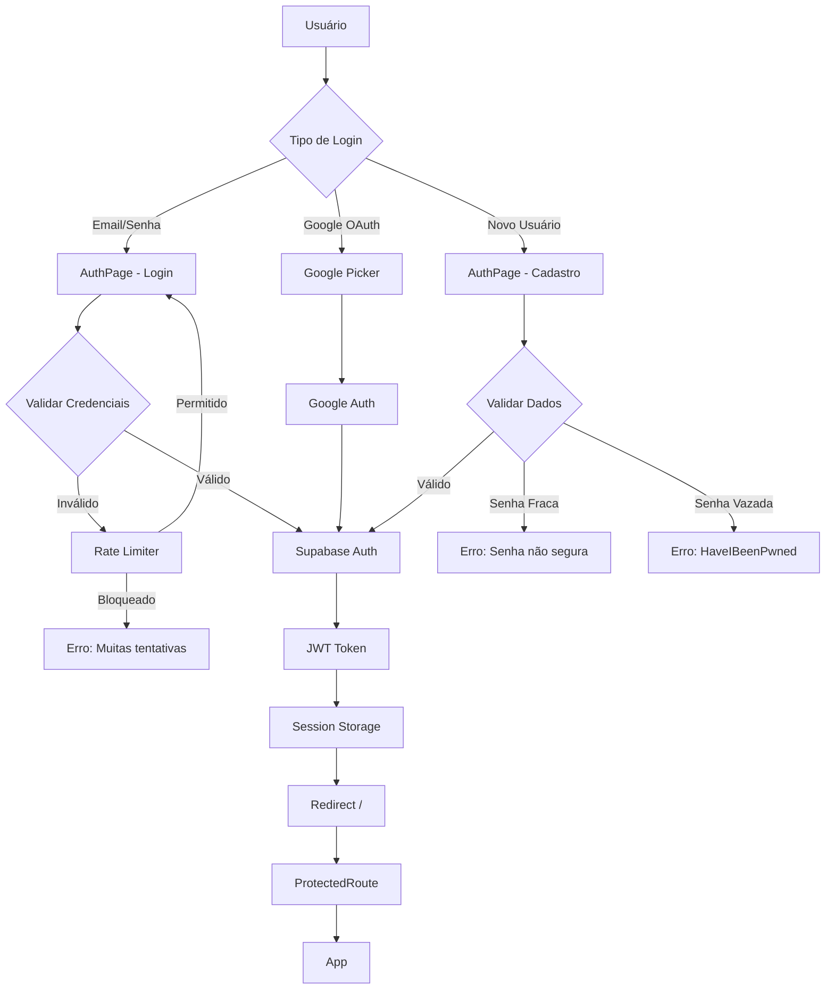

# Sistema de Autenticação - Documentação Completa

## 📋 Visão Geral

O sistema de autenticação fornece uma camada de segurança robusta para proteger o acesso à aplicação, utilizando as melhores práticas de segurança da indústria.

### Tecnologias Utilizadas

- **Supabase Auth**: Backend de autenticação gerenciado
- **JWT**: Tokens seguros para sessões
- **HaveIBeenPwned API**: Validação contra 847M+ senhas vazadas
- **Rate Limiting**: Proteção anti-brute force
- **Google OAuth**: Login social seguro

### Diagrama de Fluxo Geral



---

## 🔐 Funcionalidades

### 1. Login com Email/Senha

**Localização**: `/auth` (tab "Entrar")

**Campos**:
- Email (obrigatório, validado)
- Senha (obrigatório, min 6 chars)
- Checkbox "Lembrar-me" (opcional)

**Validações**:
- ✅ Email deve ser válido (formato)
- ✅ Senha não pode estar vazia
- ✅ Rate limiting: 5 tentativas por 15 minutos

**Fluxo**:
```typescript
Usuário insere credenciais
  → Verifica rate limit (check-rate-limit)
  → Se bloqueado: mostra erro com countdown
  → Se permitido: chama supabase.auth.signInWithPassword()
  → Se sucesso: armazena session + token JWT
  → Redireciona para /
  → Se erro: incrementa contador rate limit
```

**Código de Implementação**:
```typescript
const handleSignIn = async (e: React.FormEvent) => {
  e.preventDefault();
  setLoading(true);

  // Check rate limit
  const rateLimitCheck = await checkRateLimit('login');
  if (!rateLimitCheck.allowed) {
    toast({
      title: "Muitas tentativas",
      description: rateLimitCheck.message,
      variant: "destructive",
    });
    setLoading(false);
    return;
  }

  // Authenticate
  const { error } = await supabase.auth.signInWithPassword({
    email,
    password,
  });

  if (error) {
    await recordFailedAttempt('login');
    toast({
      title: "Erro no login",
      description: getErrorMessage(error),
      variant: "destructive",
    });
  } else {
    navigate("/");
  }
  
  setLoading(false);
};
```

---

### 2. Login com Google OAuth

**Localização**: `/auth` (botão "Entrar com Google")

**Fluxo**:
```typescript
Usuário clica "Entrar com Google"
  → Verifica rate limit
  → Se permitido: abre Google Picker
  → Usuário seleciona conta Google
  → Callback: supabase.auth.signInWithOAuth()
  → Token JWT criado automaticamente
  → Redireciona para /
```

**Configuração Necessária**:
1. Google Cloud Console: criar OAuth 2.0 Client ID
2. Supabase: configurar Google provider
3. Adicionar redirect URL: `{SUPABASE_URL}/auth/v1/callback`

**Código de Implementação**:
```typescript
const handleGoogleSignIn = async () => {
  setLoading(true);

  // Check rate limit
  const rateLimitCheck = await checkRateLimit('login');
  if (!rateLimitCheck.allowed) {
    toast({
      title: "Muitas tentativas",
      description: rateLimitCheck.message,
      variant: "destructive",
    });
    setLoading(false);
    return;
  }

  const { error } = await supabase.auth.signInWithOAuth({
    provider: 'google',
    options: {
      redirectTo: `${window.location.origin}/`,
    },
  });

  if (error) {
    await recordFailedAttempt('login');
    toast({
      title: "Erro ao conectar com Google",
      description: getErrorMessage(error),
      variant: "destructive",
    });
  }
  
  setLoading(false);
};
```

---

### 3. Cadastro com Validação Robusta

**Localização**: `/auth` (tab "Cadastrar")

**Campos**:
- Nome completo (obrigatório, min 3 chars)
- Email (obrigatório, validado)
- Senha (obrigatório, min 12 chars, forte)
- Confirmar senha (deve coincidir)
- Checkbox "Aceito termos" (obrigatório)

**Validações de Senha**:
1. ✅ Mínimo 12 caracteres
2. ✅ Pelo menos 1 maiúscula (A-Z)
3. ✅ Pelo menos 1 minúscula (a-z)
4. ✅ Pelo menos 1 número (0-9)
5. ✅ Pelo menos 1 caractere especial (!@#$%...)
6. ✅ Não está em vazamentos de dados (HaveIBeenPwned)

**Indicador de Força em Tempo Real**:
- ⏳ Verificando segurança... (debounce 500ms)
- ✅ Verde: "Senha forte e segura"
- ⚠️ Amarelo: "Senha razoável. Adicione mais caracteres"
- ❌ Vermelho: "Senha comprometida em vazamentos"

**Fluxo**:
```typescript
Usuário preenche formulário
  → Valida senha em tempo real (usePasswordSecurity)
  → Chama HaveIBeenPwned API (k-anonymity)
  → Verifica rate limit (3 tentativas/hora)
  → Se tudo válido: supabase.auth.signUp()
  → Email de confirmação enviado
  → Mensagem: "Cadastro realizado! Faça login"
```

**Código de Validação**:
```typescript
const { checkPasswordSecurity } = usePasswordSecurity();

useEffect(() => {
  if (!password) return;

  const timeoutId = setTimeout(async () => {
    const result = await checkPasswordSecurity(password);
    setPasswordSecurity(result);
  }, 500); // Debounce 500ms

  return () => clearTimeout(timeoutId);
}, [password]);

// Botão desabilitado até senha válida
<Button 
  disabled={
    loading || 
    checking || 
    !passwordSecurity?.isSecure ||
    password !== confirmPassword ||
    !acceptTerms
  }
>
  Cadastrar
</Button>
```

---

### 4. Reset de Senha Seguro

**Localização**: `/reset-password`

#### Etapa 1: Solicitar Reset

**Campos**:
- Email (obrigatório, validado)

**Fluxo**:
```typescript
Usuário insere email
  → Valida formato (Zod)
  → Verifica rate limit (5 tentativas/hora)
  → Se permitido: supabase.auth.resetPasswordForEmail()
  → Email com link enviado
  → Link válido por 1 hora
  → Mensagem: "Verifique sua caixa de entrada"
```

#### Etapa 2: Nova Senha

**URL**: `/reset-password?token=xxxxx&type=recovery`

**Campos**:
- Nova senha (validação completa)
- Confirmar senha (deve coincidir)

**Fluxo**:
```typescript
Usuário clica link no email
  → Extrai token da URL
  → Verifica se token é válido
  → Usuário insere nova senha
  → Valida senha (HaveIBeenPwned + força)
  → supabase.auth.updateUser({ password })
  → Redireciona para /auth
  → Mensagem: "Senha resetada! Faça login"
```

**Código de Reset**:
```typescript
// Etapa 1: Solicitar reset
const handleRequestReset = async (e: React.FormEvent) => {
  e.preventDefault();
  
  const rateLimitCheck = await checkRateLimit('reset_password');
  if (!rateLimitCheck.allowed) {
    toast({
      title: "Muitas solicitações",
      description: rateLimitCheck.message,
      variant: "destructive",
    });
    return;
  }

  const { error } = await supabase.auth.resetPasswordForEmail(email, {
    redirectTo: `${window.location.origin}/reset-password`,
  });

  if (error) {
    await recordFailedAttempt('reset_password');
  } else {
    setEmailSent(true);
  }
};

// Etapa 2: Atualizar senha
const handleUpdatePassword = async (e: React.FormEvent) => {
  e.preventDefault();
  
  if (!passwordSecurity?.isSecure) {
    toast({
      title: "Senha não segura",
      description: passwordSecurity.message,
      variant: "destructive",
    });
    return;
  }

  const { error } = await supabase.auth.updateUser({
    password: password,
  });

  if (error) {
    toast({
      title: "Link expirado",
      description: "Solicite um novo reset de senha.",
      variant: "destructive",
    });
  } else {
    navigate("/auth");
  }
};
```

---

### 5. Session Storage + Token Refresh Automático

**Localização**: `src/components/ProtectedRoute.tsx`

**Funcionalidades**:
1. ✅ Armazena `user` + `session` completos
2. ✅ Token JWT expira em 60 minutos
3. ✅ Refresh automático a cada 50 minutos
4. ✅ Logout automático se refresh falhar
5. ✅ Detecta mudanças de auth (onAuthStateChange)

**Fluxo**:
```typescript
Login → JWT token (60 min)
  ↓
Session storage (user + session)
  ↓
Após 50 min → supabase.auth.refreshSession()
  ↓
Se sucesso → novo token + atualiza session
  ↓
Se erro → logout automático
  ↓
Usuário mantém sessão ativa 60+ minutos
```

**Código de Implementação**:
```typescript
export function ProtectedRoute({ children }: ProtectedRouteProps) {
  const [user, setUser] = useState<User | null>(null);
  const [session, setSession] = useState<Session | null>(null);
  const [loading, setLoading] = useState(true);

  useEffect(() => {
    // Check current session
    supabase.auth.getSession().then(({ data: { session } }) => {
      setSession(session);
      setUser(session?.user ?? null);
      setLoading(false);
    });

    // Listen for auth changes
    const { data: { subscription } } = supabase.auth.onAuthStateChange(
      (_event, session) => {
        setSession(session);
        setUser(session?.user ?? null);
        setLoading(false);
      }
    );

    return () => subscription.unsubscribe();
  }, []);

  // Auto-refresh token every 50 minutes
  useEffect(() => {
    if (!session) return;

    const refreshInterval = setInterval(async () => {
      console.log('✅ Renovando token automaticamente...');
      
      try {
        const { data, error } = await supabase.auth.refreshSession();
        
        if (error) throw error;
        
        if (data.session) {
          setSession(data.session);
          setUser(data.session.user);
        }
      } catch (err) {
        console.error('❌ Erro ao renovar token:', err);
        // Logout automático se refresh falhar
        await supabase.auth.signOut();
        setSession(null);
        setUser(null);
      }
    }, 50 * 60 * 1000); // 50 minutos

    return () => clearInterval(refreshInterval);
  }, [session]);

  if (loading) {
    return <LoadingSpinner />;
  }

  if (!user) {
    return <Navigate to="/auth" replace />;
  }

  return <>{children}</>;
}
```

---

## 🛡️ Segurança

### 1. Validação Contra Senhas Vazadas

**API**: [HaveIBeenPwned](https://haveibeenpwned.com/API/v3)

**Base de Dados**: 847 milhões+ de senhas comprometidas

**Método**: k-anonymity (apenas 5 caracteres do hash SHA-1 são enviados)

**Privacidade**: ✅ Senha nunca é enviada pela rede

**Processo**:
```typescript
1. Gera SHA-1 hash da senha (client-side)
2. Envia apenas os primeiros 5 caracteres
3. API retorna lista de hashes com mesmo prefixo
4. Cliente verifica se sufixo está na lista
5. Se encontrado → senha comprometida
```

**Implementação**: `src/hooks/usePasswordSecurity.ts`

---

### 2. Rate Limiting Anti-Brute Force

**Edge Function**: `supabase/functions/check-rate-limit`

**Limites Configurados**:

| Ação | Limite | Janela | Bloqueio |
|------|--------|--------|----------|
| Login | 5 tentativas | 15 min | 15 min |
| Cadastro | 3 tentativas | 1 hora | 1 hora |
| Reset Senha | 5 tentativas | 1 hora | 30 min |

**Identificação de IP**:
1. API externa (ipify.org)
2. Fallback: Browser fingerprint

**Tabela**: `rate_limit_attempts`

**Limpeza**: Cron job a cada 6 horas

**Documentação Completa**: [RATE_LIMITING.md](./RATE_LIMITING.md)

---

### 3. JWT Token Security

**Token Lifetime**: 60 minutos

**Storage**: 
- `sessionStorage` (padrão)
- `localStorage` (se "Lembrar-me" marcado)

**Refresh Strategy**:
- Automático a cada 50 minutos
- Fail-safe: logout se refresh falhar

**Conteúdo do Token**:
```json
{
  "sub": "user-id",
  "email": "user@example.com",
  "aud": "authenticated",
  "role": "authenticated",
  "iat": 1704297600,
  "exp": 1704301200
}
```

---

### 4. RLS (Row Level Security) Policies

**Tabela**: `trainer_profiles`

```sql
-- Users can view own profile
CREATE POLICY "Users can view own profile"
  ON trainer_profiles FOR SELECT
  USING (auth.uid() = id);

-- Users can update own profile
CREATE POLICY "Users can update own profile"
  ON trainer_profiles FOR UPDATE
  USING (auth.uid() = id);
```

**Benefícios**:
- ✅ Acesso apenas aos próprios dados
- ✅ Proteção no nível do banco
- ✅ Não pode ser contornado pelo cliente

---

## 📊 Endpoints e Funções

### Supabase Auth Methods

| Método | Descrição | Uso |
|--------|-----------|-----|
| `signInWithPassword(email, password)` | Login com email/senha | AuthPage (login) |
| `signInWithOAuth(provider, options)` | Login com provedor OAuth | Google Sign-In |
| `signUp(email, password, options)` | Criar nova conta | AuthPage (cadastro) |
| `resetPasswordForEmail(email, options)` | Enviar email de reset | ResetPasswordPage |
| `updateUser(attributes)` | Atualizar dados do usuário | Atualizar senha |
| `refreshSession()` | Renovar token JWT | ProtectedRoute (auto) |
| `signOut()` | Fazer logout | Botão de logout |
| `getSession()` | Obter sessão atual | ProtectedRoute (init) |
| `onAuthStateChange(callback)` | Listener de mudanças | ProtectedRoute |

### Edge Functions

| Função | Verificação JWT | Descrição |
|--------|-----------------|-----------|
| `check-rate-limit` | ❌ Não | Verificar/registrar tentativas |

---

## 🔧 Variáveis de Ambiente

```bash
# .env (auto-gerado pelo Lovable Cloud)
VITE_SUPABASE_URL=https://xxxxx.supabase.co
VITE_SUPABASE_ANON_KEY=eyJhbGciOiJIUzI1NiIsInR5cCI6IkpXVCJ9...
VITE_SUPABASE_PROJECT_ID=xxxxx
```

**⚠️ IMPORTANTE**: Nunca commitar `.env` no Git!

---

## 🐛 Troubleshooting

### Erro: "Email inválido"

**Causa**: Formato de email incorreto

**Solução**: 
- Verificar se email contém `@` e domínio válido
- Remover espaços em branco
- Testar com outro email

### Erro: "Senha muito fraca"

**Causa**: Senha não atende requisitos mínimos

**Solução**:
- Mínimo 12 caracteres
- Adicionar maiúsculas, números e caracteres especiais
- Evitar padrões óbvios (ex: "Password123!")

### Erro: "Senha comprometida em vazamentos"

**Causa**: Senha encontrada na base HaveIBeenPwned

**Solução**:
- Criar senha única e aleatória
- Usar gerenciador de senhas
- Evitar senhas comuns ou dicionário

### Erro: "Muitas tentativas. Tente novamente em X minutos"

**Causa**: Rate limiting ativado (5 tentativas erradas)

**Solução**:
- Aguardar tempo indicado
- Verificar se credenciais estão corretas
- Usar "Esqueceu senha?" se necessário

**Desbloquear manualmente** (desenvolvimento):
```sql
UPDATE rate_limit_attempts
SET blocked_until = NULL, attempt_count = 0
WHERE ip_address = 'SEU_IP' AND action = 'login';
```

### Erro: "Token expirado"

**Causa**: Link de reset expirou (>1 hora)

**Solução**:
- Solicitar novo reset de senha
- Verificar email imediatamente após solicitar
- Checar pasta de spam

### Erro: "Google OAuth não funciona"

**Possíveis Causas**:
1. Redirect URI não configurado
2. Google Client ID incorreto
3. Domínio não autorizado

**Solução**:
1. Verificar configuração no Google Cloud Console
2. Adicionar redirect URL no Supabase:
   ```
   https://xxxxx.supabase.co/auth/v1/callback
   ```
3. Verificar se domínio está na whitelist do Google

### Erro: "Session não persiste após reload"

**Causa**: Token não está sendo armazenado corretamente

**Solução**:
1. Verificar se `ProtectedRoute` está configurado
2. Checar se `supabase.auth.getSession()` está sendo chamado
3. Verificar console do navegador para erros
4. Limpar cache e cookies

### Debug: Ver logs do Rate Limiter

```typescript
// Browser console
localStorage.debug = 'supabase:*'

// Ou na edge function
console.log('[Rate Limit] Checking login for IP:', ipAddress);
```

---

## 📈 Métricas e Monitoramento

### Queries Úteis

```sql
-- Tentativas de login nas últimas 24h
SELECT COUNT(*) as total_attempts,
       COUNT(DISTINCT ip_address) as unique_ips
FROM rate_limit_attempts
WHERE action = 'login'
  AND created_at > now() - interval '24 hours';

-- IPs bloqueados atualmente
SELECT ip_address, action, 
       blocked_until,
       EXTRACT(EPOCH FROM (blocked_until - now())) / 60 as minutes_remaining
FROM rate_limit_attempts
WHERE blocked_until > now()
ORDER BY blocked_until DESC;

-- Top IPs com mais tentativas
SELECT ip_address, action, 
       SUM(attempt_count) as total_attempts
FROM rate_limit_attempts
GROUP BY ip_address, action
ORDER BY total_attempts DESC
LIMIT 10;
```

---

## 🚀 Melhorias Futuras

- [ ] Autenticação de dois fatores (2FA)
- [ ] Magic link (login sem senha)
- [ ] Biometria (Face ID / Touch ID)
- [ ] Login com Apple / Facebook
- [ ] Dashboard de segurança para admins
- [ ] Alertas de login suspeito
- [ ] Histórico de logins
- [ ] Geolocalização de acessos
