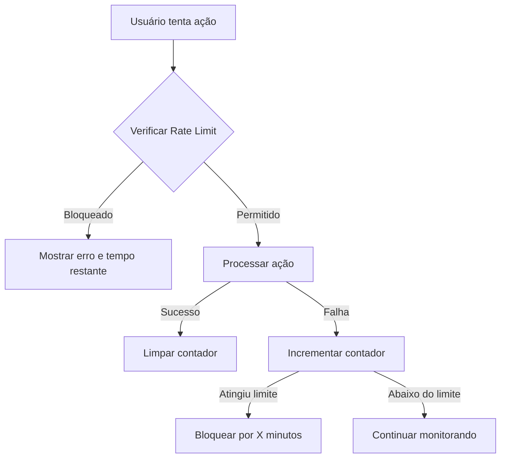

# Sistema de Rate Limiting Anti-Brute Force

## Visão Geral

O sistema de rate limiting protege a aplicação contra ataques de força bruta, limitando o número de tentativas que um usuário/IP pode fazer em diferentes operações sensíveis.

## Funcionalidades

### 1. **Proteção em Múltiplos Endpoints**

| Ação | Limite | Janela de Tempo | Bloqueio |
|------|--------|-----------------|----------|
| Login | 5 tentativas | 15 minutos | 15 minutos |
| Cadastro | 3 tentativas | 1 hora | 1 hora |
| Reset de Senha | 5 tentativas | 1 hora | 30 minutos |
| Verificação de Email | 10 tentativas | 1 hora | 15 minutos |

### 2. **Identificação de IP**

O sistema usa múltiplos métodos para identificar o usuário:
1. **IP Público**: Via API externa (ipify.org)
2. **Browser Fingerprint**: Fallback usando características do navegador

### 3. **Armazenamento de Tentativas**

Todas as tentativas são registradas na tabela `rate_limit_attempts`:

```sql
CREATE TABLE rate_limit_attempts (
  id UUID PRIMARY KEY,
  ip_address TEXT NOT NULL,
  action TEXT NOT NULL,
  attempt_count INTEGER,
  first_attempt_at TIMESTAMP,
  last_attempt_at TIMESTAMP,
  blocked_until TIMESTAMP,
  created_at TIMESTAMP
);
```

### 4. **Limpeza Automática**

Um cron job roda a cada 6 horas para:
- Deletar tentativas mais antigas que 24 horas
- Remover bloqueios expirados (com última tentativa > 1 hora atrás)

## Fluxo de Funcionamento

### 1. Tentativa de Login/Cadastro/Reset



### 2. Verificação de Rate Limit

1. Cliente chama edge function `check-rate-limit` com IP e ação
2. Edge function busca registro existente no banco
3. Verifica se IP está bloqueado
4. Verifica se janela de tempo expirou (reset contador)
5. Incrementa contador se `increment = true`
6. Bloqueia se atingiu limite máximo
7. Retorna status (permitido/bloqueado)

## Integração no Frontend

### Uso Básico

```typescript
import { checkRateLimit, recordFailedAttempt } from "@/lib/rateLimiter";

// Antes de fazer login
const rateLimitCheck = await checkRateLimit('login');
if (!rateLimitCheck.allowed) {
  // Mostrar erro
  toast({
    title: "Muitas tentativas",
    description: rateLimitCheck.message,
    variant: "destructive",
  });
  return;
}

// Após falha no login
await recordFailedAttempt('login');
```

### Feedback ao Usuário

#### Permitido
- ✅ Operação prossegue normalmente
- ℹ️ Aviso quando restam poucas tentativas (≤ 2)

#### Bloqueado
- ❌ Mensagem clara: "Muitas tentativas. Tente em X minutos"
- 🔗 Link para reset de senha (em caso de login)

## Edge Function

### `check-rate-limit`

**Entrada:**
```json
{
  "ip_address": "192.168.1.1",
  "action": "login",
  "increment": false
}
```

**Saída (Permitido):**
```json
{
  "allowed": true,
  "blocked": false,
  "remainingAttempts": 3,
  "maxAttempts": 5,
  "message": "Tentativas restantes: 3/5"
}
```

**Saída (Bloqueado):**
```json
{
  "allowed": false,
  "blocked": true,
  "blockedUntil": "2025-01-04T15:30:00Z",
  "minutesRemaining": 12,
  "message": "Muitas tentativas. Tente novamente em 12 minutos"
}
```

## Segurança

### Características de Segurança

1. **Armazenamento de IP**: Não identifica pessoalmente, apenas registra padrões
2. **Timestamps em UTC**: Garantem precisão global
3. **Service Role**: Edge function usa service role para acesso seguro ao banco
4. **Fail-Open**: Em caso de erro, permite a ação (melhor UX)
5. **RLS Policies**: Políticas de segurança aplicadas à tabela

### Auditoria

Todas as tentativas são registradas e podem ser consultadas:

```sql
SELECT * FROM rate_limit_attempts
WHERE ip_address = '192.168.1.1'
ORDER BY last_attempt_at DESC;
```

## Testes

### Testar Bloqueio de Login

1. Vá para `/auth`
2. Tente fazer login 5 vezes com credenciais erradas
3. Na 5ª tentativa, você será bloqueado por 15 minutos
4. Tente fazer login novamente → verá mensagem de bloqueio

### Testar Limpeza Automática

```sql
-- Verificar tentativas antigas
SELECT COUNT(*) FROM rate_limit_attempts
WHERE created_at < now() - interval '24 hours';

-- Executar limpeza manualmente
SELECT public.cleanup_rate_limit_attempts();
```

## Monitoramento

### Logs da Edge Function

```bash
# Ver logs da edge function
supabase functions logs check-rate-limit
```

### Queries Úteis

```sql
-- Tentativas por IP (últimas 24h)
SELECT ip_address, action, attempt_count, blocked_until
FROM rate_limit_attempts
WHERE created_at > now() - interval '24 hours'
ORDER BY last_attempt_at DESC;

-- IPs bloqueados atualmente
SELECT ip_address, action, blocked_until,
       EXTRACT(EPOCH FROM (blocked_until - now())) / 60 as minutes_remaining
FROM rate_limit_attempts
WHERE blocked_until > now()
ORDER BY blocked_until DESC;

-- Top IPs com mais tentativas
SELECT ip_address, action, SUM(attempt_count) as total_attempts
FROM rate_limit_attempts
GROUP BY ip_address, action
ORDER BY total_attempts DESC
LIMIT 10;
```

## Whitelist (Opcional)

Para adicionar IPs confiáveis que não devem ser limitados:

```sql
CREATE TABLE rate_limit_whitelist (
  ip_address TEXT PRIMARY KEY,
  reason TEXT,
  created_at TIMESTAMP DEFAULT now()
);

-- Adicionar IP confiável
INSERT INTO rate_limit_whitelist (ip_address, reason)
VALUES ('192.168.1.1', 'Office IP');
```

Depois, modificar a edge function para verificar whitelist antes de limitar.

## Troubleshooting

### IP não é detectado corretamente

- Verifique se a API ipify.org está acessível
- O fallback para fingerprint será usado automaticamente

### Usuário legítimo bloqueado

```sql
-- Desbloquear manualmente
UPDATE rate_limit_attempts
SET blocked_until = NULL,
    attempt_count = 0
WHERE ip_address = '192.168.1.1'
  AND action = 'login';
```

### Cron job não está rodando

```sql
-- Verificar jobs agendados
SELECT * FROM cron.job;

-- Executar limpeza manualmente
SELECT public.cleanup_rate_limit_attempts();
```

## Melhorias Futuras

- [ ] Whitelist de IPs confiáveis
- [ ] Alertas para múltiplas tentativas de um mesmo IP
- [ ] Dashboard de monitoramento em tempo real
- [ ] Integração com serviços anti-bot (reCAPTCHA)
- [ ] Rate limiting por usuário (além de IP)
