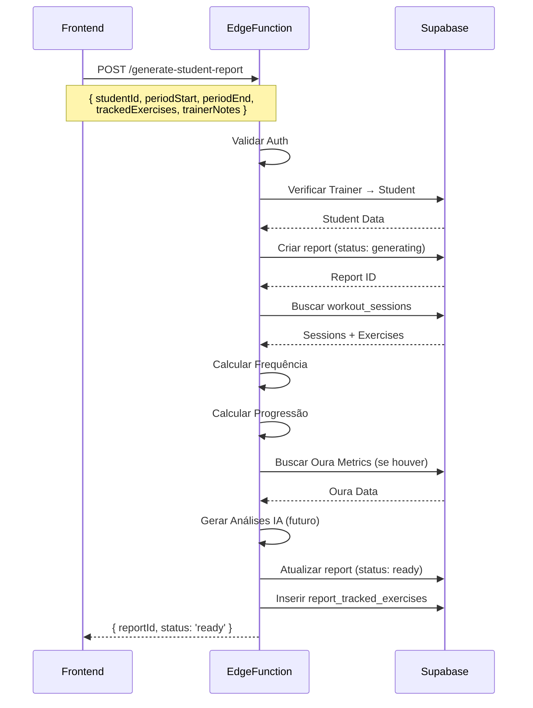

# Sistema de Relatórios - PRD (Product Requirements Document)

## 1. Visão Geral

O Sistema de Relatórios da Fabrik gera análises personalizadas de performance dos alunos, combinando dados de treino com métricas da Oura Ring. Permite que trainers acompanhem evolução, identifiquem padrões e planejem ciclos futuros.

---

## 2. Objetivos de Negócio

### Primários
- **Demonstrar valor** ao aluno através de análises objetivas de progresso
- **Facilitar ajustes** de prescrição baseados em dados reais
- **Reduzir tempo** de análise manual do trainer (de 30min → 5min)
- **Aumentar retenção** com acompanhamento profissional periódico

### Secundários
- Criar histórico de evolução do aluno
- Padronizar formato de relatórios entre trainers
- Gerar insights automáticos via IA (futuro)

---

## 3. Funcionalidades Principais

### 3.1 Geração de Relatório

**Quem**: Trainers  
**Quando**: Ao final de ciclos de treino (mensais, bimestrais, personalizados)  
**Como**: Via diálogo dedicado na página do aluno

#### Parâmetros Obrigatórios
1. **Período de Análise**
   - Últimos 30 dias
   - Últimos 60 dias
   - Últimos 90 dias
   - Período customizado (data início + data fim)

2. **Exercícios Rastreados** (mínimo 1)
   - Seleção múltipla da biblioteca de exercícios
   - Apenas exercícios que o aluno executou no período

#### Parâmetros Opcionais (Notas do Trainer)
1. **Destaques** (`trainer_highlights`)
   - Texto livre
   - Exemplos: "Ótima evolução no Agachamento", "Consistência exemplar"

2. **Pontos de Atenção** (`attention_points`)
   - Texto livre
   - Exemplos: "Técnica do deadlift precisa ajuste", "Queixas de dor lombar"

3. **Plano para Próximo Ciclo** (`next_cycle_plan`)
   - Texto livre
   - Exemplos: "Aumentar volume de treino em 10%", "Focar em mobilidade"

---

### 3.2 Cálculos e Métricas

#### 3.2.1 Frequência
```typescript
// Total de sessões realizadas
totalSessions = count(workout_sessions WHERE date BETWEEN periodStart AND periodEnd)

// Média semanal
weeksDiff = (periodEnd - periodStart) / 7
weeklyAverage = totalSessions / weeksDiff

// Aderência (%)
sessionsProposed = student.weekly_sessions_proposed * weeksDiff
adherencePercentage = (totalSessions / sessionsProposed) * 100
```

**Regras**:
- Se `weekly_sessions_proposed` não configurado → assumir 2 sessões/semana
- Aderência máxima = 100% (não permite valores > 100%)

#### 3.2.2 Progressão de Exercícios

Para cada exercício rastreado:

```typescript
// Carga inicial (primeira sessão do período)
initialLoad = exercises
  .filter(date === periodStart)
  .sort_by(date ASC)
  .first()
  .load_kg

// Carga final (última sessão do período)
finalLoad = exercises
  .filter(date === periodEnd)
  .sort_by(date DESC)
  .first()
  .load_kg

// Variação de carga (%)
loadVariation = ((finalLoad - initialLoad) / initialLoad) * 100

// Volume de trabalho (carga × reps × sets)
initialWork = initialLoad × initialReps × initialSets
finalWork = finalLoad × finalReps × finalSets
workVariation = ((finalWork - initialWork) / initialWork) * 100

// Progressão semanal
weeklyProgression = [
  { week: 1, averageLoad: X, totalVolume: Y },
  { week: 2, averageLoad: X, totalVolume: Y },
  ...
]
```

**Regras**:
- Se exercício não tem carga (peso corporal) → considerar `load_kg = 0`
- Se exercício foi executado apenas 1 vez → variação = 0%
- Variação negativa = regressão (sinalizar visualmente)

#### 3.2.3 Análises Automáticas (IA)

**Consistência**:
- Analisa padrão de frequência (dias da semana recorrentes)
- Identifica lacunas (períodos > 7 dias sem treino)
- Texto gerado: "Treinou principalmente às segundas e quartas, com boa regularidade"

**Força/Performance**:
- Compara progressão entre exercícios rastreados
- Identifica exercícios com maior/menor ganho
- Texto gerado: "Maior evolução no Agachamento (+15%), menor no Supino (+3%)"

---

### 3.3 Integração Oura Ring

**Se aluno tem Oura conectada** → incluir no relatório:

#### Métricas Capturadas
```typescript
ouraData = {
  readiness: {
    average: number,
    trend: 'improving' | 'declining' | 'stable'
  },
  sleep: {
    average: number,
    totalHours: number,
    trend: 'improving' | 'declining' | 'stable'
  },
  hrv: {
    average: number,
    trend: 'improving' | 'declining' | 'stable'
  },
  restingHR: {
    average: number,
    trend: 'improving' | 'declining' | 'stable'
  }
}
```

**Regras**:
- Se < 7 dias de dados Oura → exibir aviso "Dados insuficientes"
- Se conexão desativada → não exibir seção Oura
- Trend = comparar primeiros 30% vs últimos 30% do período

---

### 3.4 Status do Relatório

```typescript
type ReportStatus = 'generating' | 'ready' | 'failed';
```

**Estados**:
1. **generating**: Edge function processando dados
   - Duração esperada: 5-15 segundos
   - Frontend exibe skeleton loader

2. **ready**: Relatório completo e visualizável
   - Permite visualização
   - Permite exportação PDF (futuro)

3. **failed**: Erro na geração
   - Exibe mensagem de erro
   - Permite tentar novamente

---

## 4. Regras de Negócio

### RN-01: Período Mínimo
**Regra**: Período de análise deve ter **no mínimo 7 dias**  
**Motivo**: Evitar relatórios com dados insuficientes  
**Validação**: Frontend bloqueia datas inválidas

### RN-02: Exercícios Obrigatórios
**Regra**: Pelo menos **1 exercício** deve ser selecionado  
**Motivo**: Relatório sem exercícios rastreados é inútil  
**Validação**: Botão "Gerar" desabilitado até seleção

### RN-03: Permissões
**Regra**: Apenas o trainer responsável pelo aluno pode gerar/visualizar relatórios  
**Implementação**: RLS policy verifica `students.trainer_id = auth.uid()`

### RN-04: Limite de Relatórios
**Regra**: Máximo **1 relatório por período sobreposto**  
**Motivo**: Evitar duplicação desnecessária  
**Implementação**: Verificação no backend antes de criar

### RN-05: Dados Oura Opcionais
**Regra**: Relatório pode ser gerado **com ou sem** dados Oura  
**Motivo**: Nem todos alunos possuem Oura Ring  
**Implementação**: Seção Oura é condicional

### RN-06: Exercícios Não Rastreados
**Regra**: Apenas exercícios **executados no período** podem ser selecionados  
**Motivo**: Evitar confusão com exercícios inexistentes  
**Implementação**: Frontend filtra biblioteca por exercícios do período

---

## 5. Estrutura de Dados

### 5.1 Tabela `student_reports`

```sql
CREATE TABLE student_reports (
  id UUID PRIMARY KEY,
  student_id UUID NOT NULL,
  trainer_id UUID NOT NULL,
  report_type TEXT NOT NULL, -- 'personalizado'
  period_start DATE NOT NULL,
  period_end DATE NOT NULL,
  status TEXT NOT NULL, -- 'generating' | 'ready' | 'failed'
  created_at TIMESTAMPTZ,
  generated_at TIMESTAMPTZ,
  
  -- Métricas calculadas
  total_sessions INT,
  sessions_proposed INT,
  adherence_percentage NUMERIC,
  weekly_average NUMERIC,
  
  -- Análises IA
  consistency_analysis TEXT,
  strength_analysis TEXT,
  
  -- Notas do trainer
  trainer_highlights TEXT,
  attention_points TEXT,
  next_cycle_plan TEXT,
  
  -- Dados Oura (JSONB)
  oura_data JSONB
);
```

### 5.2 Tabela `report_tracked_exercises`

```sql
CREATE TABLE report_tracked_exercises (
  id UUID PRIMARY KEY,
  report_id UUID NOT NULL,
  exercise_library_id UUID,
  exercise_name TEXT NOT NULL,
  
  -- Progressão
  initial_load NUMERIC,
  final_load NUMERIC,
  load_variation_percentage NUMERIC,
  
  -- Volume
  initial_total_work NUMERIC,
  final_total_work NUMERIC,
  work_variation_percentage NUMERIC,
  
  -- Histórico semanal (JSONB)
  weekly_progression JSONB
);
```

### 5.3 Formato JSONB `weekly_progression`

```json
[
  {
    "week": 1,
    "startDate": "2024-10-01",
    "endDate": "2024-10-07",
    "averageLoad": 50.5,
    "totalVolume": 1500,
    "sessions": 2
  },
  {
    "week": 2,
    "startDate": "2024-10-08",
    "endDate": "2024-10-14",
    "averageLoad": 52.5,
    "totalVolume": 1600,
    "sessions": 3
  }
]
```

---

## 6. Edge Function: `generate-student-report`

### 6.1 Fluxo de Execução



### 6.2 Validações Backend

1. **Autenticação**: JWT válido
2. **Permissão**: `student.trainer_id === user.id`
3. **Período válido**: `periodEnd >= periodStart`
4. **Exercícios válidos**: IDs existem na biblioteca
5. **Dados suficientes**: Pelo menos 1 sessão no período

### 6.3 Tratamento de Erros

| Erro | Código | Ação |
|------|--------|------|
| Trainer não autorizado | 403 | Retornar erro + não criar report |
| Aluno não encontrado | 404 | Retornar erro |
| Sem sessões no período | 200 | Criar report vazio + aviso |
| Erro ao calcular | 500 | Marcar report como 'failed' |

---

## 7. Interface do Usuário

### 7.1 Tela: Lista de Relatórios (`StudentReportsPage`)

**URL**: `/students/:studentId/reports`

**Elementos**:
- Botão "Gerar Novo Relatório" (canto superior direito)
- Lista de relatórios (cards)
- Breadcrumbs: Alunos → [Nome] → Relatórios

**Card de Relatório**:
```
[Ícone Relatório]
Tipo: Personalizado
Período: 01/10/2024 - 30/10/2024
Sessões: 8/12 (67% aderência)
Criado em: 30/10/2024
[Botão: Ver Relatório]
```

**Estado Vazio**:
- Mensagem: "Nenhum relatório gerado ainda"
- Botão centralizado: "Gerar Primeiro Relatório"

---

### 7.2 Diálogo: Gerar Relatório (`GenerateReportDialog`)

**Campos**:

1. **Período de Análise** (Select)
   - Últimos 30 dias
   - Últimos 60 dias
   - Últimos 90 dias
   - Período customizado → mostra 2 inputs de data

2. **Exercícios Rastreados** (Checkboxes)
   - Lista com scroll
   - Busca por nome
   - Badge com contagem selecionados

3. **Destaques do Período** (Textarea, opcional)
   - Placeholder: "Ex: Ótima evolução no agachamento"

4. **Pontos de Atenção** (Textarea, opcional)
   - Placeholder: "Ex: Técnica do supino precisa ajuste"

5. **Plano Próximo Ciclo** (Textarea, opcional)
   - Placeholder: "Ex: Aumentar volume em 10%"

**Botões**:
- Cancelar (secondary)
- Gerar Relatório (primary, disabled até validar)

**Estados**:
- Loading: Spinner + "Gerando relatório..."
- Sucesso: Fechar diálogo + toast + redirecionar

---

### 7.3 Visualização de Relatório (`StudentReportView`)

**Seções**:

#### Header
- Nome do aluno
- Período analisado
- Data de geração
- Botão: Exportar PDF (futuro)

#### Seção 1: Resumo Executivo
- Total de sessões
- Aderência (%)
- Média semanal
- Badge colorido: Verde (>80%), Amarelo (60-80%), Vermelho (<60%)

#### Seção 2: Exercícios Rastreados
Para cada exercício:
- Nome
- Carga inicial → Carga final
- Variação % (cor verde/vermelho)
- Gráfico: Progressão semanal (linha)

#### Seção 3: Análises IA (futuro)
- Consistência
- Performance

#### Seção 4: Dados Oura (condicional)
- Readiness Score médio
- Sleep Score médio
- HRV médio
- Tendências visuais (setas ↑↓)

#### Seção 5: Notas do Trainer
- Destaques
- Pontos de Atenção
- Plano Próximo Ciclo

**Ações**:
- Editar Notas (abre diálogo)
- Voltar para Lista

---

## 8. Critérios de Qualidade

### 8.1 Performance
- Geração de relatório: **< 15 segundos**
- Carregamento da visualização: **< 2 segundos**
- Suporte a relatórios com **> 100 sessões**

### 8.2 Usabilidade
- Fluxo de geração: **máximo 3 passos**
- Feedback visual em **todos os estados**
- Mensagens de erro **claras e acionáveis**

### 8.3 Confiabilidade
- Cálculos matemáticos **100% precisos**
- Dados Oura sincronizados **antes da geração**
- Rollback automático em caso de erro

---

## 9. Roadmap Futuro

### Fase 2 (Q1 2025)
- [ ] Exportação para PDF
- [ ] Comparação entre relatórios
- [ ] Insights automáticos via IA (Lovable AI)

### Fase 3 (Q2 2025)
- [ ] Templates customizáveis de relatório
- [ ] Envio automático por email ao aluno
- [ ] Relatórios de grupo (comparativo entre alunos)

### Fase 4 (Q3 2025)
- [ ] Análise preditiva de lesões
- [ ] Recomendações de ajuste de prescrição
- [ ] Dashboard de relatórios agregados

---

## 10. Métricas de Sucesso

**Adoção**:
- 80% dos trainers geram pelo menos 1 relatório/mês
- Média de 2 relatórios/aluno/mês

**Eficiência**:
- Redução de 75% no tempo de análise manual
- 95% de satisfação dos trainers (NPS)

**Qualidade**:
- < 5% de taxa de erro na geração
- < 1% de reclamações sobre cálculos incorretos

---

## 11. Dependências Técnicas

### Backend
- Edge Function: `generate-student-report`
- Tabelas: `student_reports`, `report_tracked_exercises`
- RLS Policies: Acesso por trainer

### Frontend
- Hooks: `useStudentReports`, `useGenerateReport`
- Componentes: `GenerateReportDialog`, `StudentReportView`, `StudentReportsPage`

### Externas
- Oura API (opcional)
- Lovable AI (análises futuras)

---

## 12. Segurança e Privacidade

### Dados Sensíveis
- Relatórios contêm informações de saúde (LGPD)
- Acesso restrito via RLS
- Logs de acesso não implementados (futuro)

### Conformidade
- Dados armazenados em Supabase (Brasil)
- Sem exportação para terceiros
- Aluno não tem acesso direto (apenas via trainer)

---

**Versão**: 1.0  
**Data**: 2024-11-14  
**Autor**: Sistema Fabrik  
**Status**: Implementado e em produção
