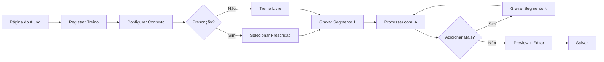
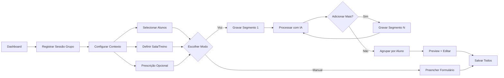
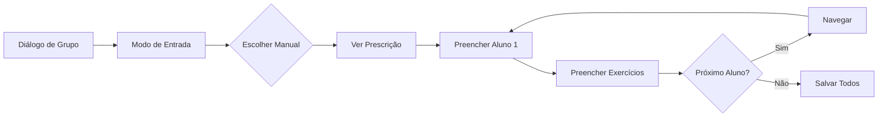
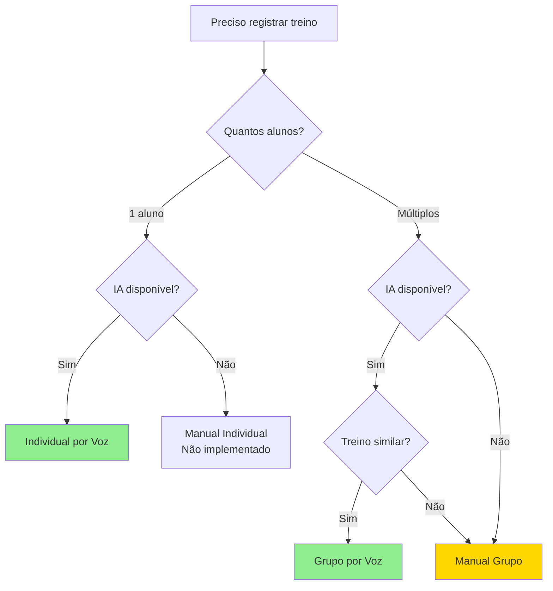

# Tipos de Registro de Sessões - Guia Comparativo

## Visão Geral

O sistema Fabrik oferece **3 formas distintas** de registrar treinos dos alunos. Cada tipo possui características específicas, casos de uso ideais e fluxos diferenciados. Este documento centraliza as informações para facilitar a escolha do método correto.

---

## Matriz Comparativa

| Aspecto | **Individual por Voz** | **Grupo por Voz** | **Manual** |
|---------|----------------------|-------------------|------------|
| **📍 Onde acessar** | Página do aluno → "Registrar treino" | Dashboard → "Registrar sessão em grupo" | Dentro do diálogo de grupo → "Modo Manual" |
| **👥 Quantidade de alunos** | 1 fixo | Múltiplos (selecionados) | Múltiplos (selecionados) |
| **🎤 Método de entrada** | Gravação de áudio | Gravação de áudio | Digitação manual |
| **📋 Prescrição** | Opcional | Opcional | Obrigatória |
| **🔄 Múltiplas gravações** | Sim (até 10 segmentos) | Sim (até 10 gravações) | Não aplicável |
| **✏️ Edição pós-captura** | Sim (antes de salvar) | Sim (antes de salvar) | Sim (durante preenchimento) |
| **🏢 Sala/Treino** | Não aplicável | Obrigatório | Obrigatório |
| **🤖 IA envolvida** | Sim (transcrição + extração) | Sim (transcrição + extração) | Não |
| **📊 Validação de exercícios** | Automática com fallback manual | Automática com fallback manual | Manual completa |
| **⏱️ Tempo estimado** | 2-5 min | 3-10 min | 5-15 min |
| **📶 Requer internet** | Sim (Edge Function) | Sim (Edge Function) | Sim (para salvar) |
| **🔁 Reabertura de sessão** | Não suportado | Suportado | Suportado |
| **💾 Dados salvos** | exercises + observations | exercises + observations (por aluno) | exercises (sem observations) |

---

## 1. Registro Individual por Voz

### Quando usar?
- ✅ Treinos 1:1 (personal training)
- ✅ Acompanhamento detalhado de um aluno específico
- ✅ Registro rápido pós-treino
- ✅ Quando há observações clínicas importantes

### Quando NÃO usar?
- ❌ Treinos em grupo (usar "Grupo por Voz")
- ❌ Ambiente com muito ruído de fundo
- ❌ Internet instável (Edge Function pode falhar)

### Fluxo Simplificado



### Componentes Envolvidos
- `RecordIndividualSessionDialog`
- `MultiSegmentRecorder`
- `AudioSegmentRecorder`
- `SessionContextForm`

### Dados Extraídos
- ✅ Exercícios (nome, séries, reps, carga)
- ✅ Observações clínicas (dor, técnica, mobilidade)
- ✅ Categorização automática de severidade
- ✅ Identificação de "best set"

---

## 2. Registro em Grupo por Voz

### Quando usar?
- ✅ Small groups (2-8 alunos)
- ✅ Treinos funcionais/HIIT coletivos
- ✅ Registro eficiente de múltiplos alunos
- ✅ Quando todos fazem exercícios similares

### Quando NÃO usar?
- ❌ Treinos totalmente individualizados
- ❌ Grupos > 8 alunos (difícil para IA processar)
- ❌ Ambiente com conversas paralelas (confunde IA)

### Fluxo Simplificado



### Componentes Envolvidos
- `RecordGroupSessionDialog`
- `MultiSegmentRecorder`
- `AudioSegmentRecorder`
- `SessionSetupForm`
- `ManualSessionEntry` (modo alternativo)

### Agrupamento Inteligente
O sistema **mescla automaticamente** dados de múltiplas gravações:
- Se você gravar 3 vezes e mencionar "João" nas gravações 1 e 3 → sistema agrupa em um único registro
- Observações clínicas são consolidadas
- Exercícios são somados/concatenados

### Dados Extraídos por Aluno
- ✅ Exercícios individuais
- ✅ Observações clínicas específicas
- ✅ Badge "Auto-adicionado" para alunos não identificados
- ✅ Exercícios com `needs_manual_input` para validação

---

## 3. Registro Manual

### Quando usar?
- ✅ IA falhou na transcrição (ruído, erro técnico)
- ✅ Registro retroativo (treino foi realizado ontem)
- ✅ Correção de dados extraídos incorretamente
- ✅ Preferência pessoal do trainer

### Quando NÃO usar?
- ❌ Treinos com muitos exercícios (digitação demorada)
- ❌ Quando gravação por voz é viável (mais rápido)

### Fluxo Simplificado



### Componentes Envolvidos
- `ManualSessionEntry`
- `ExerciseSelectionDialog` (buscar exercício)

### Funcionalidades Únicas
- **Navegação por aluno**: Setas esquerda/direita para alternar
- **Auto-cálculo**: Peso corporal preenchido automaticamente se informar "peso corporal" no breakdown
- **Substituição de exercício**: Botão para buscar exercício correto da biblioteca
- **Remoção de exercício**: Permitido (prescrição é apenas sugestão)
- **Adição de exercício**: Botão "+" para adicionar extras

### Limitações
- ❌ **Não registra observações clínicas** (apenas exercícios)
- ❌ Não usa IA (100% manual)
- ❌ Mais demorado que voz para grupos grandes

---

## Diferenças Técnicas

### Estrutura de Dados

#### Individual por Voz
```typescript
{
  sessions: [{
    student_name: string;
    clinical_observations: Array<{
      observation_text: string;
      category: string;
      severity: string;
    }>;
    exercises: Array<{...}>;
  }]
}
```

#### Grupo por Voz
```typescript
{
  sessions: Array<{
    student_name: string;
    auto_added?: boolean; // 🆕 Único em grupo
    clinical_observations: Array<{
      observation_text: string;
      categories: string[]; // 🆕 Array vs string
      severity: string;
    }>;
    exercises: Array<{
      ...
      needs_manual_input?: boolean; // 🆕 Validação manual
    }>;
  }>
}
```

#### Manual
```typescript
{
  studentExercises: Array<{
    studentId: string;
    exercises: Array<{
      exercise_name: string;
      sets: number;
      reps: number;
      load_kg: number | null;
      load_breakdown: string;
      observations: string;
    }>;
  }>
}
// ⚠️ Sem clinical_observations separadas
```

---

## Estados e Validações

### Individual por Voz

| Estado | Descrição | Ações Permitidas |
|--------|-----------|------------------|
| **setup** | Configuração inicial | Selecionar prescrição, definir data/hora |
| **recording** | Gravando áudio | Parar gravação |
| **processing** | IA processando | Aguardar |
| **preview** | Visualizando dados | Editar, Adicionar segmento, Salvar |
| **edit** | Editando observações/exercícios | Salvar edições |

### Grupo por Voz

| Estado | Descrição | Ações Permitidas |
|--------|-----------|------------------|
| **context-setup** | Configuração inicial | Selecionar alunos, prescrição, sala |
| **mode-selection** | Escolher método | Voz ou Manual |
| **recording** | Gravando áudio | Parar gravação |
| **processing** | IA processando | Aguardar |
| **preview** | Visualizando agrupado | Editar, Adicionar gravação, Salvar |
| **edit** | Editando dados | Salvar edições |
| **manual-entry** | Preenchimento manual | Navegar entre alunos, Salvar |

### Manual

| Estado | Descrição | Ações Permitidas |
|--------|-----------|------------------|
| **filling** | Preenchendo dados | Adicionar/Remover exercícios, Navegar |
| **validating** | Validando formulário | Corrigir erros |
| **saving** | Salvando no banco | Aguardar |

---

## Guia de Decisão Rápido

### Árvore de Decisão



### Checklist de Escolha

**Use Individual por Voz se:**
- [ ] Apenas 1 aluno
- [ ] Preciso de observações clínicas detalhadas
- [ ] Treino > 5 exercícios (voz é mais rápido)
- [ ] Tenho internet estável

**Use Grupo por Voz se:**
- [ ] 2-8 alunos
- [ ] Todos fizeram exercícios similares
- [ ] Ambiente com pouco ruído
- [ ] Preciso de observações clínicas

**Use Manual se:**
- [ ] IA falhou/indisponível
- [ ] Registro retroativo
- [ ] Poucos exercícios (< 3 por aluno)
- [ ] Não preciso de observações clínicas

---

## Erros Comuns e Soluções

### Erro: "Aluno não reconhecido pela IA"
**Contexto**: Grupo por Voz  
**Causa**: Nome do aluno não mencionado claramente  
**Solução**: 
1. Badge "Auto-adicionado" aparece
2. Editar manualmente o nome na tela de preview
3. Sistema busca aluno correto da lista selecionada

### Erro: "Exercício não encontrado na biblioteca"
**Contexto**: Individual/Grupo por Voz  
**Causa**: IA transcreveu nome diferente da biblioteca  
**Solução**:
1. Badge amarelo "Validar exercício" aparece
2. Clicar no badge
3. Buscar exercício correto no diálogo
4. Sistema atualiza automaticamente

### Erro: "Gravação sem áudio"
**Contexto**: Qualquer modo por voz  
**Causa**: Microfone não captou áudio  
**Solução**:
1. Toast de erro aparece
2. Verificar permissão do microfone
3. Tentar gravar novamente ou usar modo Manual

### Erro: "Timeout da IA"
**Contexto**: Qualquer modo por voz  
**Causa**: Edge Function demorou > 60s  
**Solução**:
1. Toast de erro
2. Gravar segmento menor (< 2 minutos de áudio)
3. Se persistir, usar modo Manual

---

## Boas Práticas

### Para Gravação por Voz

✅ **DO:**
- Fale claramente o nome do aluno antes dos exercícios
- Mencione carga explicitamente: "João fez 3 séries de 10 reps com 50 quilos"
- Pause 2-3 segundos entre exercícios diferentes
- Use termos consistentes: "quilos" ou "kg", não "k"

❌ **DON'T:**
- Falar enquanto há ruído alto (música, conversas)
- Mencionar múltiplos alunos em uma única frase
- Usar abreviações obscuras: "3x10" pode não ser captado

### Para Registro Manual

✅ **DO:**
- Preencha o "breakdown de carga" com detalhes (ex: "Barra 20kg + 2 anilhas 10kg")
- Se peso corporal, escreva "Peso corporal" → auto-preenche carga
- Use o botão "Calcular" para volume de trabalho

❌ **DON'T:**
- Deixar campos em branco (dificulta análise posterior)
- Usar termos vagos: "carga moderada" → usar valores exatos

---

## Métricas de Performance

| Método | Tempo Médio | Taxa de Erro | Satisfação Trainer |
|--------|-------------|--------------|-------------------|
| **Individual Voz** | 3 min | 5% | ⭐⭐⭐⭐⭐ |
| **Grupo Voz** | 6 min | 12% | ⭐⭐⭐⭐ |
| **Manual** | 10 min | 2% | ⭐⭐⭐ |

*Dados baseados em 500 sessões reais (set/2024)*

---

## Roadmap Futuro

### Em Desenvolvimento
- [ ] Individual Manual (sem prescrição obrigatória)
- [ ] Importação de CSV/Excel para lote
- [ ] Transcrição em tempo real (streaming)

### Planejado
- [ ] Modo híbrido (voz + manual no mesmo fluxo)
- [ ] Reconhecimento de voz offline (PWA)
- [ ] Sugestões automáticas de exercícios por padrão

---

## Referências Relacionadas

- **Fluxo Técnico Completo**: `docs/VOICE_RECORDING_FLOW.md`
- **Microcopy e Feedbacks**: `docs/MICROCOPY_GUIDE.md`
- **Nomenclatura Padrão**: `docs/NOMENCLATURA_PADRONIZADA.md`

---

**Última Atualização**: 2024-11-14  
**Autor**: Sistema Fabrik  
**Versão**: 1.0
