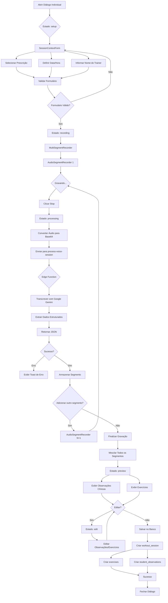
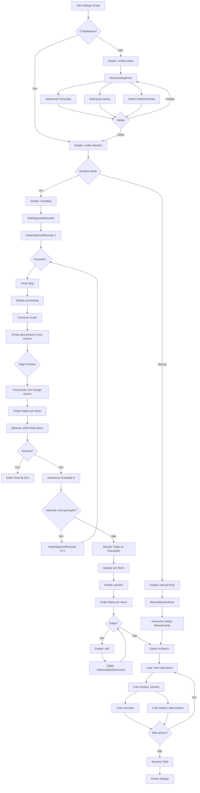
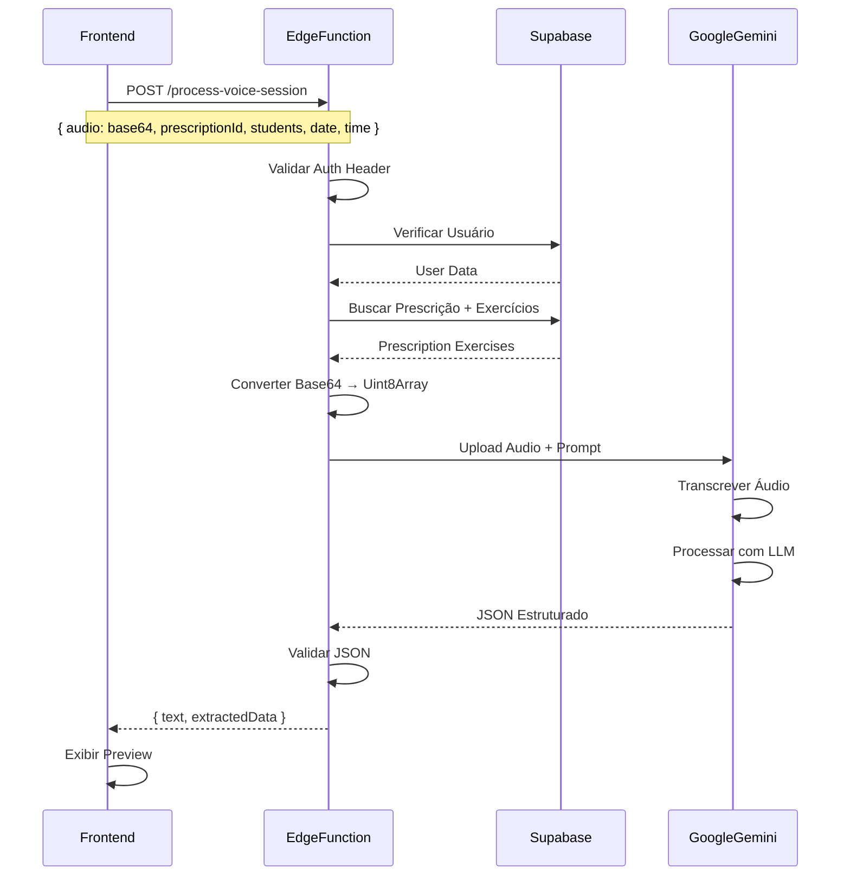

# Fluxo de Gravação por Voz - Documentação Técnica

## Visão Geral

O sistema de gravação por voz da Fabrik permite registrar treinos através de áudio, utilizando IA para transcrever e extrair dados estruturados. Existem **dois fluxos distintos**: **Sessão Individual** e **Sessão em Grupo**.

---

## 1. Fluxo de Sessão Individual

### Componentes Envolvidos
- **`RecordIndividualSessionDialog`**: Diálogo principal do fluxo individual
- **`MultiSegmentRecorder`**: Orquestrador de múltiplos segmentos de áudio
- **`AudioSegmentRecorder`**: Componente de gravação individual
- **`SessionContextForm`**: Formulário de contexto da sessão
- **Edge Function**: `process-voice-session`

### Estados do Diálogo
```typescript
type DialogState = 'setup' | 'recording' | 'processing' | 'preview' | 'edit';
```

### Diagrama de Fluxo



### Estrutura de Dados Extraída

```typescript
interface SessionData {
  sessions: Array<{
    student_name: string;
    clinical_observations?: Array<{
      observation_text: string;
      category: 'dor' | 'mobilidade' | 'força' | 'técnica' | 'geral';
      severity: 'baixa' | 'média' | 'alta';
    }>;
    exercises: Array<{
      prescribed_exercise_name?: string | null;
      executed_exercise_name: string;
      sets?: number | null;
      reps: number | null;
      load_kg?: number | null;
      load_breakdown: string;
      observations?: string | null;
      is_best_set: boolean;
    }>;
  }>;
}
```

---

## 2. Fluxo de Sessão em Grupo

### Componentes Envolvidos
- **`RecordGroupSessionDialog`**: Diálogo principal do fluxo em grupo
- **`MultiSegmentRecorder`**: Orquestrador de múltiplos segmentos
- **`AudioSegmentRecorder`**: Componente de gravação individual
- **`SessionSetupForm`**: Formulário de configuração
- **`ManualSessionEntry`**: Entrada manual de dados (modo alternativo)
- **Edge Function**: `process-voice-session`

### Estados do Diálogo
```typescript
type DialogState = 'context-setup' | 'mode-selection' | 'recording' | 'processing' | 'preview' | 'edit' | 'manual-entry';
```

### Diagrama de Fluxo



### Estrutura de Dados em Grupo

```typescript
interface SessionData {
  sessions: Array<{
    student_name: string;
    auto_added?: boolean;
    clinical_observations?: Array<{
      observation_text: string;
      categories: string[];
      severity: 'baixa' | 'média' | 'alta';
    }>;
    exercises: Array<{
      prescribed_exercise_name?: string | null;
      executed_exercise_name: string;
      sets?: number | null;
      reps: number;
      load_kg?: number | null;
      load_breakdown: string;
      observations?: string | null;
      is_best_set: boolean;
      needs_manual_input?: boolean;
    }>;
  }>;
}
```

### Agrupamento de Alunos

O sistema **agrupa automaticamente** dados de múltiplas gravações por aluno:

```typescript
interface MergedStudent {
  student_name: string;
  recording_numbers: number[];
  clinical_observations: Array<...>;
  exercises: Array<...>;
}
```

---

## 3. Edge Function: `process-voice-session`

### Responsabilidades

1. **Autenticação**: Valida JWT do usuário
2. **Validação de Permissões**: Verifica se o trainer possui a prescrição
3. **Buscar Contexto**: Carrega exercícios prescritos do banco
4. **Transcrição**: Envia áudio para Google Gemini (modelo `gemini-1.5-flash`)
5. **Extração**: Usa prompt estruturado para extrair JSON
6. **Retorno**: Envia dados estruturados de volta ao frontend

### Fluxo Técnico



### Prompt de Extração

O prompt instrui o modelo Gemini a:

- Identificar **alunos mencionados** no áudio
- Extrair **exercícios executados** (nome, séries, reps, carga)
- Detectar **observações clínicas** (dor, limitações, técnica)
- Classificar **severidade** (baixa, média, alta)
- Marcar **best set** (melhor série de cada exercício)

### Limite de Gravações

- **Máximo**: 10 gravações por sessão (`MAX_RECORDINGS = 10`)
- **Controle**: Frontend bloqueia botão "Adicionar" ao atingir limite

---

## 4. Estados de Erro e Feedback

### Erros Comuns

| Erro | Causa | Feedback ao Usuário |
|------|-------|---------------------|
| **Microfone Negado** | Usuário recusou permissão | Toast: "Permissão de microfone necessária" |
| **Áudio Muito Curto** | Gravação < 1 segundo | Toast: "Grave pelo menos 1 segundo de áudio" |
| **Timeout na IA** | API Gemini demorou > 60s | Toast: "Erro ao processar áudio. Tente novamente" |
| **Dados Inválidos** | JSON retornado está malformado | Toast: "Erro ao extrair dados. Revise manualmente" |
| **Sem Permissão** | Trainer não possui prescrição | Toast: "Você não tem acesso a esta prescrição" |
| **Estudante Não Encontrado** | Nome do aluno não reconhecido | Badge "Auto-adicionado" + Permite edição |

### Feedback Visual

- **Gravando**: Badge "Gravando..." + ícone de microfone pulsando
- **Processando**: Spinner + texto "Processando áudio..."
- **Sucesso**: Toast verde + transição para preview
- **Erro**: Toast vermelho + opção de tentar novamente

---

## 5. Fluxo de Validação de Exercícios

### Problema: Nomes Não Reconhecidos

Quando a IA extrai um exercício que **não existe na biblioteca**, o sistema:

1. **Marca** com `needs_manual_input: true`
2. **Exibe Badge Amarelo**: "Validar exercício"
3. **Abre Diálogo**: `ExerciseSelectionDialog`
4. **Trainer escolhe**: Exercício correto da biblioteca
5. **Sistema atualiza**: Nome e `exercise_library_id`

### Diagrama de Validação

```mermaid
graph LR
    A[IA Extrai: "Agachamento"] --> B{Existe na Biblioteca?}
    B -->|Sim| C[Mapear exercise_library_id]
    B -->|Não| D[needs_manual_input = true]
    D --> E[Badge Amarelo]
    E --> F[Trainer Clica]
    F --> G[ExerciseSelectionDialog]
    G --> H[Buscar Exercício]
    H --> I[Selecionar Correto]
    I --> J[Atualizar Nome + ID]
    J --> K[Badge Verde: Validado]
```

---

## 6. Salvamento no Banco de Dados

### Tabelas Envolvidas

1. **`workout_sessions`**: Sessão principal
   - `student_id`, `date`, `time`, `prescription_id`, `room_name`, `workout_name`, `trainer_name`

2. **`exercises`**: Exercícios executados
   - `session_id`, `exercise_name`, `sets`, `reps`, `load_kg`, `load_breakdown`, `observations`, `is_best_set`

3. **`student_observations`**: Observações clínicas
   - `student_id`, `session_id`, `observation_text`, `categories`, `severity`, `created_by`

### Transação Atômica

```typescript
// 1. Criar sessão
const { data: session } = await supabase
  .from('workout_sessions')
  .insert({ student_id, date, time, ... })
  .select()
  .single();

// 2. Criar exercícios
await supabase.from('exercises').insert(
  exercises.map(ex => ({ session_id: session.id, ...ex }))
);

// 3. Criar observações
await supabase.from('student_observations').insert(
  observations.map(obs => ({ student_id, session_id: session.id, ...obs }))
);
```

---

## 7. Diferenças entre Individual e Grupo

| Aspecto | Individual | Grupo |
|---------|-----------|-------|
| **Alunos** | 1 fixo | Múltiplos (selecionados) |
| **Prescrição** | Opcional | Opcional |
| **Modo de Entrada** | Apenas Voz | Voz **ou** Manual |
| **Agrupamento** | N/A | Agrupa por aluno entre gravações |
| **Sala/Treino** | N/A | Obrigatório informar |
| **Reabertura** | Não suportado | Suportado |

---

## 8. Limites e Constraints

| Item | Valor | Motivo |
|------|-------|--------|
| **Gravações por sessão** | 10 | Evitar sessões muito longas |
| **Tamanho do áudio** | ~10MB | Limite da Edge Function |
| **Timeout da IA** | 60s | Timeout do Gemini API |
| **Alunos por sessão grupo** | Ilimitado | Definido pelo trainer |

---

## 9. Melhorias Futuras (Roadmap)

- [ ] Suporte a gravação pausada/retomada
- [ ] Transcrição em tempo real (streaming)
- [ ] Detecção automática de exercícios por voz ativa
- [ ] Exportação de áudio original (.webm)
- [ ] Histórico de transcrições editadas

---

## 10. Checklist de Testes

### Individual
- [ ] Gravar sessão com prescrição ativa
- [ ] Gravar sessão sem prescrição (livre)
- [ ] Adicionar múltiplos segmentos
- [ ] Editar observações e exercícios
- [ ] Validar exercício não reconhecido
- [ ] Salvar sessão completa

### Grupo
- [ ] Configurar contexto (prescrição, alunos, sala)
- [ ] Gravar múltiplas gravações
- [ ] Agrupar corretamente por aluno
- [ ] Editar dados de aluno específico
- [ ] Salvar sessão para todos os alunos
- [ ] Reabrir sessão existente
- [ ] Modo manual completo

---

**Última Atualização**: 2024-11-14  
**Autor**: Sistema Fabrik  
**Versão**: 1.0
